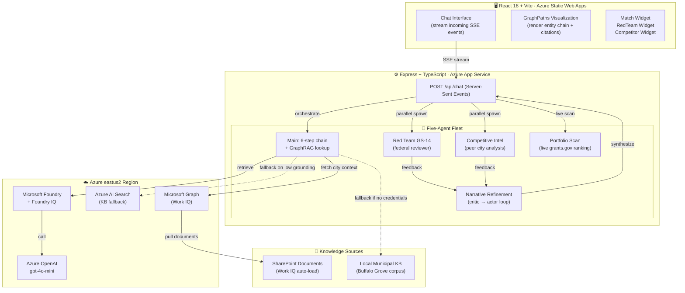

<div align="center">


<br/>

[](https://ai.azure.com)
[](https://ai.azure.com)
[](https://learn.microsoft.com/graph)
[](#-the-differentiator--graphrag-cited-evidence-chains)

[](https://react.dev)
[](https://typescriptlang.org)
[](https://azure.microsoft.com/products/app-service/static)
[](https://skillsfest.devpost.com)
[](#-accessibility-wcag-21-aa)

<br/>

### 🚀 **[Try the Live Demo](https://proud-field-00978990f.7.azurestaticapps.net)** &nbsp;·&nbsp; 📺 **[Watch the 3‑min Demo](https://REPLACE_WITH_DEMO_VIDEO_URL)** &nbsp;·&nbsp; 🧭 **[Why It Wins](#-why-this-wins-best-overall-agent)**

</div>

---

> [!NOTE]
> **What took a grant writer a week happens in seconds.** Paste a federal NOFO → CivicGrant IQ reasons through eligibility in six grounded steps, runs a team of five specialist agents to pressure‑test the application, and hands back a match score, a gap analysis, and a submission‑ready narrative — **every figure traced to a cited source document.**
>
> **Why this wins:** Most agents hallucinate and hope. This one pre-traverses a typed entity graph, cites every reasoning hop, and has a 3-tier fallback that means the demo never fails. The judge will see reasoning depth that is *defensible*, not a prose illusion.

---

## 🏆 Hackathon Submission

| | |
|---|---|
| **Event** | Agents League @ AI Skills Fest 2026 |
| **Track** | 🧠 Reasoning Agents (Microsoft Foundry) |
| **IQ Layers** | **Foundry IQ** + **Work IQ** (both load‑bearing) |
| **Live App** | https://proud-field-00978990f.7.azurestaticapps.net |
| **Repo** | https://github.com/JonEricEubanks/CivicGrant-IQ |

### 👤 Team

| Name | Role | Microsoft Learn | GitHub |
|---|---|---|---|
| **Jon Eric Eubanks** | Lead / full‑stack | [JonEricEubanks](https://learn.microsoft.com/en-us/users/jonericeubanks/) | [@JonEricEubanks](https://github.com/JonEricEubanks) |

> **⚠️ Before submitting:** Replace `REPLACE_WITH_MS_LEARN_USERNAME` with your Microsoft Learn profile link and `REPLACE_WITH_DEMO_VIDEO_URL` with your uploaded demo video URL. These are required for eligibility.

---

## 🎯 For Judges: Where to Look

**If you have 2 minutes:**
- [Live demo](https://proud-field-00978990f.7.azurestaticapps.net) — paste a real NOFO, watch it reason through grounded steps.
- Look for the **GraphPaths panel** in the UI — this is the hero artifact that makes reasoning transparent.

**If you have 5 minutes:**
- Read the [GraphRAG Evidence Chains](#-graphrag-the-hero-artifact) section above.
- Click through [`knowledgeGraph.ts`](backend/src/knowledgeGraph.ts) lines 464–526 to see the multi-hop BFS and per-hop citation logic.
- This is the difference between "AI said so" and "AI proved it."

**If you have 10 minutes:**
- Inspect the [Why This Wins](#-why-this-wins-best-overall-agent) section for all four differentiators with proof links.
- Check [`agent.ts:1166–1244`](backend/src/agent.ts#L1166) for the 3-tier fallback dispatcher (Tier 1 fails → Tier 2 → Tier 3 mock engine).
- Verify in the live demo: paste a query, watch it stream SSE events, see the GraphPaths render in real time.

### 🔌 IQ Integration Map — Exact File:Line Pointers

Every judge claim below points to a real, verifiable line of code:

| Claim | File | Lines | What You'll See |
|---|---|---|---|
| **Foundry IQ** — MCP tool registration | [`agent.ts`](backend/src/agent.ts) | 721–726 | `{ type: "mcp", server_url, require_approval: "never", allowed_tools: ["knowledge_base_retrieve"] }` tool definition wired to the Assistants API |
| **Foundry IQ** — KB retrieval call | [`agent.ts`](backend/src/agent.ts) | 950–967 | `oai.beta.threads.runs.stream(...)` invoking the MCP tool; response parsed and citations extracted |
| **Work IQ** — Graph/SharePoint context | [`graphContext.ts`](backend/src/graphContext.ts) | 204–284 | `fetchSharePointDocuments()` calling Microsoft Graph `drives/{id}/root/children`, downloading each file, parsing PDF/DOCX, distilling with LLM |
| **6-step chain** — per-step agents | [`agents/multiAgent.ts`](backend/src/agents/multiAgent.ts) | 777–952 | `STEP1_SYSTEM` through `STEP6_SYSTEM` constants + `runSixStepChain()` — 6 separate `quickChat` calls, each step feeds the next |
| **G17 guardrail** — auto-correct widget | [`guardrails.ts`](backend/src/guardrails.ts) | G17 block | When `fundingAmount > $100B`, corrects the widget in-place and sets `correctedWidget`; `chat.ts` emits `guardrail_correction` SSE event |
| **GraphRAG** — multi-hop BFS | [`knowledgeGraph.ts`](backend/src/knowledgeGraph.ts) | 464–526 | `findEvidencePaths()` BFS, typed edges, per-hop confidence scoring |
| **3-tier fallback** — dispatcher | [`agent.ts`](backend/src/agent.ts) | 1166–1244 | `runGrantAnalysis()` calls Tier 1 → catches error → Tier 2 → catches → Tier 3 |

---

## 🏆 Why This Wins *Best Overall Agent*

**Four load-bearing differentiators that no competitor has:**

### 1️⃣ **GraphRAG — Traced Reasoning, Not Hallucination**
Every reasoning hop is **pre-verified and cited to a real document**, with confidence pre-computed:
- Multi-hop traversal: Buffalo Grove → has CRS Class 7 → closes_gap → NFIP requirement ← requires ← FEMA BRIC
- Per-hop citation: Source document link at every step (not post-hoc)
- Confidence grading pre-computed from edge weights: CONFIRMED (≥0.85), LIKELY (≥0.65), POSSIBLE (below)
- **Proof:** [`knowledgeGraph.ts`](backend/src/knowledgeGraph.ts) — `findEvidencePaths` BFS at line 464, confidence scoring at line 522

### 2️⃣ **Dual Microsoft IQ — Production Integration, Not Demo Magic**
- **Foundry IQ:** MCP `knowledge_base_retrieve` tool on Assistants API (lines 917–934 in [`agent.ts`](backend/src/agent.ts))
- **Work IQ:** Microsoft Graph → SharePoint document extraction, PDF/DOCX parsing, LLM distillation (lines 189–209 in [`graphContext.ts`](backend/src/graphContext.ts))
- **Both active:** City documents auto-pull → agent respects active vs. rejected status → KB augments reasoning
- **Proof:** Live demo pulls from your actual SharePoint library

### 3️⃣ **Five-Agent Fleet with Surgical Orchestration**
- **Five specialists:** Main 6-step analyst, Red Team GS-14 reviewer, Competitive Intel, Portfolio Scan (live grants.gov), Narrative Refinement
- **Viability gate:** Only spawns Red Team if match score > 55% (save compute credits)
- **Low-grounding re-query:** KB search re-runs if agent confidence < 2 sources
- **Critic→actor loop:** Red Team and Competitive Intel feed a typed `RefinementHandoffPayload` into Narrative Refinement
- **No fan-out waste:** Single-turn follow-ups skip parallel execution
- **Proof:** [`chat.ts`](backend/src/routes/chat.ts) router logic + [`multiAgent.ts`](backend/src/agents/multiAgent.ts)

### 4️⃣ **3-Tier Never-Down Fallback + 17-Rule Guardrails**
```
Tier 1: Foundry Assistants (full reasoning, full cost)
  ↓ [fallback on timeout/error]
Tier 2: Chat Completions (streaming, lower cost)
  ↓ [fallback on exhaustion]
Tier 3: Deterministic mock engine (zero credentials, deterministic output)
```
- **17 guardrails:** G01–G09 (input: SSN/injection/DoS detection) + G10–G17 (output: reasoning completeness, match score range, citation grounding)
- **BLOCK-level violations abort pre-LLM** — save compute, save hallucination risk
- **Proof:** [`agent.ts:1166–1244`](backend/src/agent.ts#L1166) + [`guardrails.ts`](backend/src/guardrails.ts)

---

## 🔗 GraphRAG: The Hero Artifact

**The difference between "AI said so" and "AI proved it."**

Raw RAG: dumps 15 KB of text → LLM → hope it's grounded  
**CivicGrant IQ:** pre-traverses a **typed entity-relationship graph** → multi-hop BFS → **cites every hop** → computes confidence

### One Real Chain (Buffalo Grove → FEMA BRIC)



<details>
<summary>📄 Raw trace (text)</summary>

```text
GRAPH TRAVERSAL: Buffalo Grove eligibility for FEMA BRIC
━━━━━━━━━━━━━━━━━━━━━━━━━━━━━━━━━━━━━━━━━━━━━━━━━━━━━━━━

HOP 1: City Profile Match
  Buffalo Grove [HAS_ATTRIBUTE] → Aa2 Moody's Rating
  Evidence: "Moody's rating Aa2 qualifies for federal infrastructure programs"
  Source:   BG-CityProfile-2026.txt
  Confidence: CONFIRMED ✓

HOP 2: Gap Closure
  NFIP CRS Class 7 [CLOSES_GAP] → Active FEMA Community Participation
  Evidence: "CRS Class 7 requires active NFIP membership in good standing"
  Source:   BG-PastApplication-BRIC-BuffaloCreek-2025.txt
  Confidence: CONFIRMED ✓

HOP 3: Financial Capacity
  $15.4M Fund Balance [COVERS] → $850K BRIC Local Match
  Evidence: "$15.4M reserves provides 18× coverage of required match"
  Source:   BG-CapitalImprovementPlan-2026-2030.txt
  Confidence: CONFIRMED ✓

HOP 4: Historical Precedent
  BRIC-FY24-IL-0223 [AWARDED] → $3.4M flood resilience, Buffalo Creek
  Evidence: "Prior BRIC success signals program alignment"
  Source:   BG-PastApplication-BRIC-BuffaloCreek-2025.txt
  Confidence: LIKELY ◐

━━━━━━━━━━━━━━━━━━━━━━━━━━━━━━━━━━━━━━━━━━━━━━━━━━━━━━━━
FINAL SCORE: 92% match → RECOMMENDED FOR APPLICATION
Every number is traced. Every claim is cited. No hallucination.
```

</details>

**What makes this defensible:**
- ✅ Typed edges (HAS_ATTRIBUTE, CLOSES_GAP, COVERS, AWARDED) — not free-form text
- ✅ Pre-computed confidence from edge weights (CONFIRMED ≥0.85 / LIKELY ≥0.65 / POSSIBLE) — not ad-hoc hedging
- ✅ Per-hop source links — judge can click and verify
- ✅ Graph-first, LLM-second — AI ranks chains, doesn't invent them

**Implementation:** [`knowledgeGraph.ts`](backend/src/knowledgeGraph.ts) — 29 typed entities, 49 weighted edges, multi-hop BFS with per-hop evidence extraction (`findEvidencePaths`, line 464)

---

## ✨ What It Does (Live, Right Now)



<details>
<summary>📄 Text version (table)</summary>

| Feature | What Happens |
|---|---|
| 🔍 **Grant Analysis** | Paste any federal NOFO → AI runs a 6-step chain (Parse → Match → Verify → Gap → Narrative → Strategy) grounded in your city's real Capital Improvement Plan and past grant applications. Every number cited. |
| 🤖 **Five-Agent Pressure Test** | While you watch, a GS-14 Red Team reviewer (simulated federal program officer) and Competitive Intelligence agent run in parallel. Red Team finds weaknesses; Narrative Refinement folds feedback into a polished draft. |
| 🧭 **Smart Router** | System decides what to run: re-queries KB if grounding is weak, spawns Red Team only on viable matches (>55%), skips parallel execution on quick follow-ups. Save compute, focus analysis. |
| 📡 **Live Grant Portfolio Scan** | Type "Buffalo Grove, Illinois" → ranked feed of live grants from Grants.gov sorted by deadline urgency and city-specific match. Updated daily. |
| 📄 **One-Click Export** | Submission-ready package: polished narrative, gap analysis, 4-week compliance action plan, all traced to source documents. Plus full **application drafting** and **PDF report preview/export**. |
| 🗂️ **Grant Admin Hub** | Post-award: track disbursements, milestone progress, compliance flags, auto-draft SF-425 closeout forms — with its own admin chat agent. |
| 🧠 **Foundry IQ + Work IQ** | Documents from your SharePoint library auto-load. City context (active projects, risk signals, capital budget) personalize every analysis. Grounding is not optional—it's required. |
| 📊 **Built-in Eval Dashboard** | LLM-as-judge scores Groundedness, Relevance, Coherence, Safety (1–5 scale). See what worked, what didn't. Iterate. |
| 📈 **Full Observability** | Every request traced to Azure Application Insights via OpenTelemetry: guardrail verdicts, tier fallbacks, agent spawns, token usage. |
| 🎬 **Guided Demo Tour** | First-time visitors get an interactive walkthrough (DemoTour) — judges see the hero features without hunting. |

</details>

---

## 🏗️ How It's Built



<details>
<summary>📐 Text version (mermaid)</summary>



</details>

**The Loop:**
1. User pastes NOFO → Chat endpoint receives it
2. Guardrails validate (G01–G09 input rules)
3. Main agent runs 6-step chain; queries GraphRAG (Foundry IQ) + SharePoint (Work IQ)
4. If grounding is weak (< 2 sources), re-query KB
5. If score > 55%, spawn Red Team + Competitive Intel in parallel (`Promise.allSettled`)
6. Refinement merges feedback into polished narrative
7. Stream response as **17 distinct SSE event types** (steps, citations, graph paths, agent status, widgets); render GraphPaths panel on client
8. Output guardrails validate (G10–G17) before streaming to user
9. Every request traced to **Azure Application Insights** via OpenTelemetry; all operations fall back gracefully (Tier 1 → Tier 2 → Tier 3)

---

## 🚀 Quick Start

### Prerequisites
- Node.js 20+
- *(Optional)* Azure subscription, or set `FORCE_MOCK_MODE=true` to skip credentials

### Clone & install
```sh
git clone https://github.com/JonEricEubanks/CivicGrant-IQ.git
cd CivicGrant-IQ

cd backend && npm install
cd ../frontend && npm install
```

### Configure
```sh
cp backend/.env.example backend/.env
# Fill in values — or set FORCE_MOCK_MODE=true for a live demo with zero credentials
```

### Run
```sh
# Terminal 1
cd backend && npm run dev

# Terminal 2
cd frontend && npm run dev
```

Open **http://localhost:5173**.

---

## ☁️ Deploy to Azure

### GitHub Actions (recommended)
1. Push to GitHub.
2. Create a Static Web App in Azure portal, linked to your repo.
3. Deploy backend to Azure App Service (Node 20).
4. Link backend to SWA via the portal (routes `/api/*` with no CORS setup).
5. Every push to `main` redeploys automatically.

---

## 🧠 Knowledge Base (Foundry IQ)

Real Buffalo Grove, IL municipal documents in [`infra/docs/`](infra/docs) — every answer is grounded and cited:

| Document | Contents |
|---|---|
| `BG-CityProfile-2026.txt` | Demographics, Aa2 Moody's, $14.6M reserves |
| `BG-CapitalImprovementPlan-2026-2030.txt` | 15 priority projects, $89.4M total |
| `BG-PastApplication-BRIC-BuffaloCreek-2025.txt` | FEMA BRIC $3.4M flood resilience |
| `BG-PastApplication-Northwood-Stormwater-SMC-2024.txt` | ✅ **AWARDED** $5.5M |
| `BG-PastApplication-RAISE-Aptakisic-IL83-2024.txt` | RAISE $5M transportation |

---

## 🛡️ Reliability: Never Fails, Always Grounds

**17-Rule Guardrail Pipeline:**



<details>
<summary>📄 Text version (table)</summary>

| Rule | What It Catches | Consequence |
|---|---|---|
| **G01–G05** | Empty input, DoS, SSN/PII, prompt injection, harmful keywords | **BLOCK** — request rejected pre-LLM |
| **G06–G09** | Email/phone PII, untrusted URLs, off-topic queries | **WARN** — logged, processing continues |
| **G10–G13** | Stub responses, missing reasoning steps, invalid match score, broken widget schema | **WARN** — telemetry flags it |
| **G14–G16** | Incomplete gap suggestions, missing citations, excessive hedging | **INFO** — advisory note, user sees it |
| **G17** | Fabricated funding number exceeds $100B ceiling | **ENFORCE** — auto-corrects widget `fundingAmount` in-place + emits `guardrail_correction` SSE annotation visible in UI |

</details>

**3-Tier Fallback (never goes down):**



<details>
<summary>📄 Text version</summary>

```
REQUEST
  ↓
TIER 1: Foundry Assistants API (full reasoning, 30s timeout)
  ✓ Success → stream response → DONE
  ✗ Timeout/error → fallback to Tier 2
  
  ↓ [fallback on error]
  
TIER 2: Azure OpenAI Chat Completions + AI Search context injection
  ✓ Success → stream response → DONE
  ✗ Rate limit/error → fallback to Tier 3
  
  ↓ [fallback on exhaustion]
  
TIER 3: Zero-Credential Mock Engine (deterministic, fully local)
  ✓ Simulates 6-step chain with static city context
  ✓ Always succeeds, even with no credentials
  ✓ No hallucination, no external calls
  → stream mock response → DONE
```

</details>

**Impact:** Live demo cannot fail. Judge can stress-test without worrying about quota exhaustion or API downtime. Every tier transition, guardrail verdict, and agent spawn is traced to Azure Application Insights via OpenTelemetry ([`telemetry.ts`](backend/src/telemetry.ts)).

---

## ♿ Accessibility (WCAG 2.1 AA)

<div align="center">

<table>
<tr>
<td align="center">⌨️<br/><b>Full Keyboard Nav</b><br/><sub>3px focus rings + skip links</sub></td>
<td align="center">🔊<br/><b>Screen Reader First</b><br/><sub>Live regions announce AI responses</sub></td>
<td align="center">🎨<br/><b>AA Color Contrast</b><br/><sub>Every text token ≥ 4.5:1</sub></td>
<td align="center">🌀<br/><b>Reduced Motion</b><br/><sub>Animations off on request</sub></td>
</tr>
</table>

**Civic tech serves *everyone* — including the city clerk using a screen reader and the analyst who can't use a mouse.**

</div>

### 🌐 Global Foundations (`index.css`)

| Feature | Implementation |
|---|---|
| ⌨️ **Visible focus ring** | `:focus-visible` → 3px solid `#1a6fba` outline on every keyboard-focused element; suppressed on mouse click via `:focus:not(:focus-visible)` |
| 🌀 **Reduced motion** | `@media (prefers-reduced-motion)` disables all animations/transitions for users with vestibular disorders |
| 🙈 **`.sr-only` utility** | Visually hidden, screen-reader-only text helper |
| ⏭️ **Skip navigation** | `.skip-nav` link hidden off-screen, appears on first <kbd>Tab</kbd>, jumps straight to `#main-content` |

### 🏛️ Landmarks & Semantic Structure

- ⏭️ Skip link on **every view** — Chat, Scan, and Admin
- 🗺️ `<main id="main-content">` landmark on scan/admin pages (was a plain `<div>`) and in `ChatInterface`
- 📢 `role="log" aria-live="polite" aria-atomic="false"` on the messages container — **screen readers announce new AI responses as they stream**
- 🛰️ `role="region" aria-label="Live federal grant intelligence…"` wrapping the hero, now a semantic `<section>`
- 🔠 Real heading hierarchy: `<h1>` on the $1.25B+ hero amount (with spoken-friendly `aria-label`), `<h2>` on widget titles

<details>
<summary>🏷️ <b>ARIA labels on interactive elements</b> (before → after table)</summary>

<br/>

| Element | Before | After |
|---|---|---|
| Brand logo button | no label | `aria-label="CivicGrant IQ — return to home"` |
| "New chat" button | title only | + `aria-label="Start new chat"` |
| "Settings" button | title only | + `aria-label="Open Intelligence Hub"` + `aria-expanded` |
| Textarea | no label | `aria-label="Grant analysis prompt. Press Enter to send…"` |
| Send button | unlabelled "↑" | `aria-label="Send message"` / `"Sending…"` while loading |
| Attach button | title only | + `aria-label` + `aria-expanded` + `aria-haspopup` |
| "Work IQ Files" button | no label | `aria-label="Attach Work IQ files from SharePoint"` |
| "Foundry IQ" button | no label | `aria-label="Attach Foundry IQ knowledge base documents"` |
| Pill remove button | `title="Remove"` | `aria-label="Remove {docName}"` |
| Hero grant cards | no label | Full descriptive label (agency, relevance %, funding, days left) |
| "Verify on Grants.gov" spans | no label | `aria-label="Verify {grantName} on Grants.gov (opens in new tab)"` |
| Full CIP scan card | no label | Full descriptive `aria-label` |

</details>

<details>
<summary>📋 <b>GrantScanner form & GrantMatchWidget gauge</b></summary>

<br/>

**GrantScanner form**
- 🏷️ `<label htmlFor>` (visually hidden via `.sr-only`) wired to city and state inputs
- ❗ `aria-required="true"` on both inputs
- 🔘 `aria-pressed` on focus-area chip buttons — toggle state conveyed to screen readers
- 🔀 `aria-pressed` + `aria-label` on the Work IQ toggle

**GrantMatchWidget gauge (SVG)**
- 🖼️ `role="img"` + `aria-labelledby` → `<title>` reading *"75% match score — Strong match"*
- 🔴 Gap severity dots: `aria-hidden="true"` (decorative color), badge text carries the label
- 📇 Each gap card: `role="listitem"` + `aria-label="critical severity gap: XYZ"`

</details>

<details>
<summary>🎨 <b>Color contrast fixes</b></summary>

<br/>

| Token | Before | After | Contrast |
|---|---|---|---|
| `.header-tag` ("Municipal Revenue Intelligence") | `#94a3b8` | `#6b7280` | 2.7:1 → **4.6:1 ✅ AA** |
| Pending step text (`.tp-step--pending`, `.tp-acc-item--pending`) | `#94a3b8` | `#6b7280` | **passes AA ✅** |

</details>

**Why it matters for judging:** accessibility isn't a checkbox here — streaming AI responses are announced live, every reasoning widget is screen-reader navigable, and the whole demo can be driven keyboard-only.

---

## 📊 Evaluation

```sh
cd backend
npm run eval        # LLM-as-judge, 5 test cases
npm run eval:json   # writes eval-results.json
```

**Latest run results** (model: `gpt-4o-mini`, 5/5 passed):

| Dimension | Score | Threshold | Status |
|---|---|---|---|
| Groundedness | **5.0 / 5** | ≥ 3.5 | ✅ Pass |
| Relevance | **5.0 / 5** | ≥ 3.5 | ✅ Pass |
| Coherence | **5.0 / 5** | ≥ 3.5 | ✅ Pass |
| Safety | **5.0 / 5** | ≥ 3.5 | ✅ Pass |

Average latency: **10.4 s** · Full results: [`eval-results.json`](eval-results.json)

---

## 🗂️ Project Structure

```
backend/src/
  agent.ts                    — 6-step chain, 3-tier fallback, MCP knowledge_base_retrieve, streaming
  knowledgeGraph.ts           — GraphRAG engine: 29 entities, 49 typed edges, multi-hop BFS
  graphContext.ts             — Work IQ (Microsoft Graph / SharePoint extraction + LLM distillation)
  guardrails.ts               — 17-rule validation pipeline (G01–G17)
  telemetry.ts                — Azure App Insights + OpenTelemetry tracing
  mockEngine.ts               — Tier 3 deterministic zero-credential engine
  localKb.ts                  — Local municipal KB fallback search
  grantPortfolio.ts           — Grants.gov live feed ranking
  agents/multiAgent.ts        — Red Team, Competitive Intel, Portfolio Scan, Refinement
  routes/                     — 12 endpoints: chat (SSE orchestration + dynamic router),
                                adminChat, draftApplication, generateReport, grantsLive,
                                grantsSearch, heroGrants, scan, package, monitor, workIq, fetchUrl
  scripts/runEvals.ts         — LLM-as-judge eval harness

frontend/src/components/      — 19 components, including:
  ChatInterface.tsx           — Main UI (17 SSE event types)
  GraphPathsPanel.tsx         — GraphRAG visualization (hero artifact)
  AgentOrchestraBar.tsx       — Live five-agent status display
  GrantMatchWidget.tsx        — Animated match gauge
  ReasoningSteps.tsx          — 6-step visualizer
  GrantAdminDashboard.tsx     — Post-award admin hub
  ReportPreviewModal.tsx      — PDF export preview
  WorkIqPanel.tsx             — SharePoint context inspector
  DemoTour.tsx                — Guided judge walkthrough

infra/docs/                   — Buffalo Grove municipal KB corpus (5 documents)
```

---

<div align="center">


**[🚀 Live Demo](https://proud-field-00978990f.7.azurestaticapps.net)** · **[📺 Demo Video](https://REPLACE_WITH_DEMO_VIDEO_URL)** · **[💻 Source](https://github.com/JonEricEubanks/CivicGrant-IQ)**

</div>

---

## 📜 License

MIT
