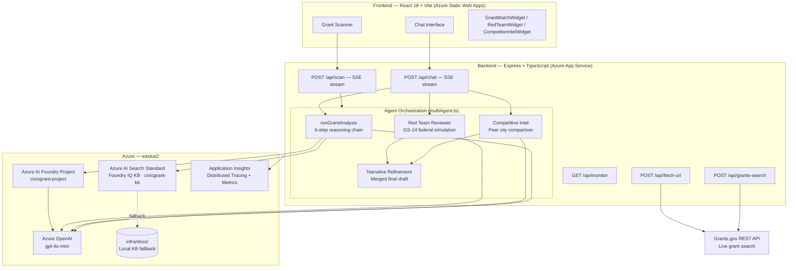

<div align="center">

# 🏛️ CivicGrant IQ

### *"You have $8.7M in grants your city qualifies for this month."*

**Municipal Grant Revenue Intelligence — powered by Azure AI Foundry**

[](https://ai.azure.com)
[](https://react.dev)
[](https://typescriptlang.org)
[](https://azure.microsoft.com/products/app-service/static)
[](https://skillsfest.devpost.com)

---

> Local government staff spend **40+ hours per grant** searching, reading NOFOs, and writing applications.
> CivicGrant IQ compresses that to **seconds** — grounded in your city's real documents, with cited answers.

**[🚀 Live Demo →](https://proud-field-00978990f.7.azurestaticapps.net)** &nbsp;|&nbsp; **[📺 Watch the 3-min demo →](#)**

<!-- TODO: update the two links above before submission -->

</div>

---

## 🏆 Hackathon Submission

**Event:** Agents League @ AI Skills Fest 2026
**Track:** Reasoning Agents (Microsoft Foundry)
**IQ Layer:** Foundry IQ — Azure AI Search knowledge base connected directly to a Foundry project, delivering cited, grounded grant analysis with no hallucinations.

### Team

| Name | Role | Microsoft Learn | GitHub |
|---|---|---|---|
| _Your name_ | _Lead / full-stack_ | _@ms-learn-handle_ | _@github-handle_ |

> Replace placeholder rows with real names and **Microsoft Learn usernames** before submitting. Solo entrants: keep a single row.

---

## ✨ What It Does

| Feature | Description |
|---|---|
| 🔍 **Grant Analysis** | Paste any NOFO URL or text — the agent runs a **6-step reasoning chain** (Parse → Match → Verify → Gap Analysis → Narrative → Strategy) against your city's real CIP and past applications |
| 🤖 **Multi-Agent Pipeline** | Competitive Intelligence + Red Team federal reviewer run in parallel; a Narrative Refinement agent merges both into a polished draft |
| 📡 **Live Grant Scan** | Describe any city and instantly get a ranked portfolio from a live Grants.gov API search |
| 📄 **One-Click Package** | Export a submission-ready HTML grant package with narrative, gap analysis, and a 4-week action plan |
| 🧠 **Foundry IQ Knowledge Base** | Answers are grounded in real municipal documents (CIP, past applications, city profile) with cited sources — no hallucinations |
| 📊 **Evaluation Dashboard** | LLM-as-judge scores every response on Groundedness, Relevance, Coherence, and Safety (1–5 scale) |

---

## 🏗️ Architecture



**Deployment topology:** Frontend on Azure Static Web Apps (CDN-backed, global), backend on Azure App Service (Node 20), linked via SWA proxy so all `/api/*` calls route server-side with no browser CORS exposure.

---

## 🚀 Quick Start — Local Dev

### Prerequisites

- Node.js 20+
- Azure subscription with resources deployed (run `./infra/deploy.ps1` to provision everything)

### 1. Clone and install

```sh
git clone https://github.com/<your-org>/civicgrant-iq.git
cd civicgrant-iq

cd backend && npm install
cd ../frontend && npm install
```

### 2. Configure environment

```sh
cp backend/.env.example backend/.env
# Fill in backend/.env with your Azure values
```

| Variable | Description |
|---|---|
| `FOUNDRY_PROJECT_ENDPOINT` | Azure AI Foundry project endpoint URL |
| `AOAI_ENDPOINT` | Azure OpenAI endpoint |
| `AOAI_API_KEY` | Azure OpenAI API key |
| `SEARCH_ENDPOINT` | Azure AI Search endpoint (Foundry IQ KB) |
| `SEARCH_API_KEY` | Azure AI Search admin key |
| `APPLICATIONINSIGHTS_CONNECTION_STRING` | App Insights connection string (optional) |

### 3. Run locally

```sh
# Terminal 1 — backend (port 3001)
cd backend && npm run dev

# Terminal 2 — frontend (port 5173, proxies /api → localhost:3001)
cd frontend && npm run dev
```

Open [http://localhost:5173](http://localhost:5173).

---

## ☁️ Deploy to Azure Static Web Apps

### Option A — GitHub Actions (recommended for the hackathon)

1. **Push this repo to GitHub.**
2. **Create a Static Web App** in the Azure portal — link it to your repo. Azure automatically commits `.github/workflows/azure-static-web-apps.yml` with the deployment token.
   > Or via CLI: `az staticwebapp create --name civicgrant-iq --resource-group rg-skillsfest --location eastus2 --source https://github.com/<org>/<repo> --branch main --app-location frontend --output-location dist --login-with-github`
3. **Deploy the backend** to Azure App Service (Node 20 runtime) and set all `backend/.env` keys as App Settings.
4. **Link the backend** to the SWA: SWA → Settings → APIs → Link an existing backend → select your App Service. This routes every `/api/*` call through the SWA proxy — no CORS config needed.
5. **Every push to `main`** triggers the GitHub Actions workflow (`.github/workflows/azure-static-web-apps.yml`) and redeploys the frontend automatically.

### Required GitHub Secrets

| Secret | Where to get it |
|---|---|
| `AZURE_STATIC_WEB_APPS_API_TOKEN` | SWA → Overview → Manage deployment token |

### Option B — SWA CLI (quick one-shot)

```sh
cd frontend && npm run build
npx @azure/static-web-apps-cli deploy ./dist \
  --deployment-token $AZURE_STATIC_WEB_APPS_API_TOKEN \
  --env production
```

---

## 🧠 Knowledge Base (Foundry IQ)

Real Buffalo Grove, IL municipal documents indexed in Azure AI Search — every answer is grounded and cited:

| Document | Contents |
|---|---|
| `BG-CityProfile-2026.txt` | Demographics, Aa2 Moody's rating, $14.6M reserves |
| `BG-CapitalImprovementPlan-2026-2030.txt` | 15 priority projects, $89.4M total, $34.4M in active grant pursuit |
| `BG-PastApplication-BRIC-BuffaloCreek-2025.txt` | FEMA BRIC $3.4M flood warning + green infrastructure |
| `BG-PastApplication-Northwood-Stormwater-SMC-2024.txt` | ✅ **AWARDED** $5.5M SMC SIIP stormwater |
| `BG-PastApplication-RAISE-Aptakisic-IL83-2024.txt` | RAISE FY2024 $5M transportation safety |

Re-index after editing docs: `node infra/indexDocs.mjs`

---

## 📊 Evaluation

```sh
cd backend
npm run eval        # LLM-as-judge, 5 test cases, prints scores to console
npm run eval:json   # writes eval-results.json (surfaced at GET /api/monitor)
```

Scores each response on **Groundedness · Relevance · Coherence · Safety** (1–5 each) using a GPT-4o-mini judge call.

---

## 🔒 Security

| Control | Detail |
|---|---|
| **Rate limiting** | `/api/chat` 10 req/min/IP · `/api/scan` 5 req/min/IP via `express-rate-limit` |
| **SSRF protection** | `/api/fetch-url` blocks RFC-1918, link-local (169.254.x), IMDS, and non-standard ports; responses are byte + timeout capped |
| **Secrets isolation** | All keys loaded from `backend/.env` (gitignored); `config.ts` throws at startup on any missing required var |
| **Security headers** | SWA delivers `X-Content-Type-Options: nosniff`, `X-Frame-Options: DENY`, `Referrer-Policy`, and a `Content-Security-Policy` on every response |
| **Input validation** | All user-supplied inputs validated at route boundaries before AI calls |
| **CORS** | Backend only accepts requests from configured origins (env-driven); SWA linked-backend proxy removes browser CORS exposure entirely in production |
| **Health probe** | `GET /api/health` reports KB reachability, OpenAI/Foundry config, and active KB source; runs at startup |
| **Scope note** | No end-user authentication (hackathon scope). For production: add Azure API Management + Entra ID in front of the SSE endpoints. |

---

## 🗂️ Project Structure

```
backend/src/
  agent.ts            — Core: 6-step reasoning chain, Foundry IQ KB retrieval, streaming
  agents/
    multiAgent.ts     — Red Team, Competitive Intel, Narrative Refinement sub-agents
  routes/
    chat.ts           — POST /api/chat  (SSE multi-agent orchestration)
    scan.ts           — POST /api/scan  (portfolio scanner)
    fetchUrl.ts       — POST /api/fetch-url  (server-side NOFO fetch + SSRF guard)
    grantsSearch.ts   — POST /api/grants-search  (live Grants.gov)
    monitor.ts        — GET  /api/monitor  (telemetry + eval scores)
  scripts/
    runEvals.ts       — LLM-as-judge evaluation suite

frontend/src/
  components/
    ChatInterface.tsx       — Main chat UI, sidebar, starter prompts
    GrantMatchWidget.tsx    — Animated gauge + gap cards + strategy panel
    GrantPipelineWidget.tsx — Ranked grant pipeline with progress bars
    RedTeamWidget.tsx       — Federal reviewer simulation scorecard
    CompetitorIntelWidget.tsx — Competitive landscape visualization
    AgentDrawer.tsx         — Slide-in drawer for secondary agent results
    ReasoningSteps.tsx      — 6-step reasoning chain visualizer
    ReportPreviewModal.tsx  — Grant package preview + export

infra/
  deploy.ps1          — Deploys all Azure resources, prints .env values
  indexDocs.mjs       — Uploads + indexes docs into Foundry IQ KB
  docs/               — Real Buffalo Grove municipal documents

.github/workflows/
  azure-static-web-apps.yml  — CI/CD: build frontend + deploy to SWA on push to main
```

---

## ☁️ Azure Resources

| Resource | Name | Location |
|---|---|---|
| AI Foundry Hub | `civicgrant-hub` | eastus2 |
| AI Foundry Project | `civicgrant-project` | eastus2 |
| Azure OpenAI | `civicgrant-aoai` | eastus2 |
| Azure AI Search (Standard) | `civicgrant-search` | eastus2 |
| Storage Account | `civicgrantstore` | northcentralus |
| Application Insights | `civicgrant-insights` | eastus2 |
| Static Web App | `civicgrant-iq` | eastus2 |

Models: `gpt-4o-mini` (chat + eval judge) · `text-embedding-3-large` (KB embeddings)

---

## 📜 License

MIT — see [LICENSE](LICENSE)
